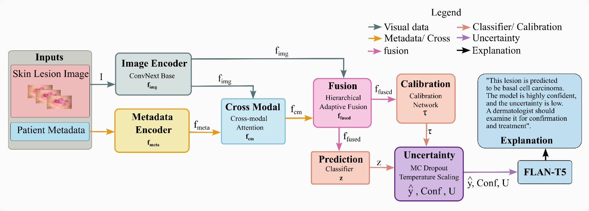

# DermaExplain-LLM: Uncertainty-Aware Multimodal Skin Lesion Diagnosis with Attention-Guided Fusion and Patient-Friendly Explanations

DermaExplain-LLM is a multimodal and uncertainty-aware framework for skin lesion diagnosis that jointly uses **clinical skin lesion images** and **structured patient metadata** to improve diagnostic prediction, estimate predictive uncertainty, and generate **patient-friendly natural language explanations**.

The framework combines:
- a **ConvNeXt-based image encoder**
- a **metadata encoder** for numeric, binary, and categorical clinical attributes
- **cross-modal attention**
- **hierarchical adaptive fusion**
- **sample-wise calibration**
- **Monte Carlo Dropout-based uncertainty estimation**
- **FLAN-T5-based explanation generation**

---

## Overview

Automated skin lesion diagnosis is challenging because clinically relevant evidence is distributed across both lesion appearance and patient metadata. Reliable medical decision support requires not only accurate prediction, but also meaningful uncertainty estimation and interpretable explanation.

DermaExplain-LLM addresses these needs through a unified pipeline that:
1. learns multimodal representations from clinical images and metadata,
2. models their interaction through cross-modal attention,
3. adaptively fuses image and metadata information,
4. predicts lesion class with uncertainty-aware inference, and
5. generates a patient-friendly explanation grounded in diagnostic output and clinical context.

---

## Architecture

The overall framework contains the following stages:

- **Image Encoder**  
  Extracts lesion-specific visual representations from clinical dermatology images using a pretrained ConvNeXt backbone.

- **Metadata Encoder**  
  Encodes heterogeneous patient metadata, including:
  - numeric attributes
  - binary clinical indicators
  - categorical attributes

- **Cross-Modal Attention**  
  Refines visual features using patient metadata as contextual guidance.

- **Hierarchical Adaptive Fusion**  
  Combines the original image representation and the metadata-refined representation through learned gating.

- **Prediction + Calibration + Uncertainty**  
  Produces lesion logits, applies calibration, and estimates confidence and uncertainty using Monte Carlo Dropout.

- **Explanation Generation**  
  Uses FLAN-T5 to generate patient-friendly natural language explanations from the predicted diagnosis, confidence, uncertainty, and relevant metadata.

## Architecture Figure



---

## Key Features

- Multimodal skin lesion diagnosis using **images + patient metadata**
- Explicit **cross-modal interaction**
- **Hierarchical adaptive fusion** for multimodal representation learning
- **Uncertainty-aware inference** using Monte Carlo Dropout
- **Sample-wise calibration** for improved confidence reliability
- **Patient-friendly explanation generation** using a large language model

---

## Dataset

This project is based on the **PAD-UFES-20** dataset, which contains clinical skin lesion images and structured patient metadata.

### Diagnostic Categories
- Actinic keratosis (ACK)
- Basal cell carcinoma (BCC)
- Melanoma (MEL)
- Melanocytic nevus (NEV)
- Squamous cell carcinoma (SCC)
- Seborrheic keratosis (SEK)

### Metadata Types
- **Numeric**: age, lesion diameters
- **Binary**: itch, growth, pain, bleeding, smoking, alcohol consumption, biopsy status, cancer history, etc.
- **Categorical**: gender, anatomical region, Fitzpatrick skin type, lesion elevation

### Data Notes
- Clinical images and metadata are used jointly.
- Data preprocessing, metadata grouping, and train/validation/test split files will be provided in this repository and/or linked below.
- Please ensure that you follow the original dataset license and citation requirements.

---

## Results

The proposed framework achieved strong performance on PAD-UFES-20:

- **Accuracy:** 91.5%
- **F1-score:** 91.2%
- **Precision:** 91.4%
- **Recall:** 91.0%

Additional analyses include:
- ablation study
- calibration metrics
- per-class performance
- qualitative explanation examples

---

## Downloads

The code, processed data, pretrained weights, and supplementary materials will be uploaded gradually.

- **Paper:** [Google Drive](PASTE_PAPER_LINK_HERE)
- **Dataset:** [Google Drive](PASTE_DATA_LINK_HERE)
- **Metadata:** [Google Drive](PASTE_METADATA_LINK_HERE)
- **Train/Val/Test Splits:** [Google Drive](PASTE_SPLIT_LINK_HERE)
- **Pretrained Weights:** [Google Drive](PASTE_MODEL_LINK_HERE)
- **Architecture Figure:** [Google Drive](PASTE_FIGURE_LINK_HERE)
- **Supplementary Material:** [Google Drive](PASTE_SUPPLEMENTARY_LINK_HERE)

---

## Repository Structure

```text
DermaExplain-LLM/
│
├── data/
│   ├── raw/
│   ├── processed/
│   ├── splits/
│   └── README.md
│
├── models/
│   ├── image_encoder/
│   ├── metadata_encoder/
│   ├── fusion/
│   ├── calibration/
│   └── explanation/
│
├── notebooks/
│   ├── data_preprocessing.ipynb
│   ├── training.ipynb
│   ├── evaluation.ipynb
│   └── explanation_generation.ipynb
│
├── scripts/
│   ├── train.py
│   ├── evaluate.py
│   ├── infer.py
│   ├── calibrate.py
│   └── generate_explanations.py
│
├── figures/
│   └── main.png
│
├── outputs/
│   ├── checkpoints/
│   ├── logs/
│   ├── predictions/
│   └── explanations/
│
├── requirements.txt
├── README.md
└── LICENSE
